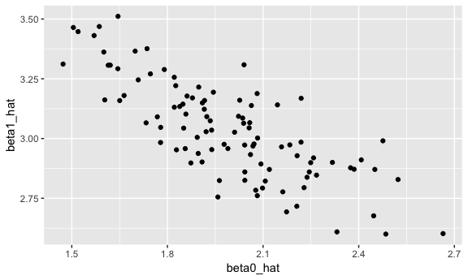

simulation
================
Catherine
11/1/2018

#### simulation function

``` r
sim_regression = function(n, beta0 = 2, beta1 = 3) {
  
  sim_data = tibble(
    x = rnorm(n, mean = 1, sd = 1),
    y = beta0 + beta1 * x + rnorm(n, 0, 1)
  )
  
  ls_fit = lm(y ~ x, data = sim_data)
  
  tibble(
    beta0_hat = coef(ls_fit)[1],
    beta1_hat = coef(ls_fit)[2]
  )
}
```

Run it for a few times

``` r
sim_regression(n = 30, 2, 3)
```

    ## # A tibble: 1 x 2
    ##   beta0_hat beta1_hat
    ##       <dbl>     <dbl>
    ## 1      2.03      2.89

Iterate simulations

``` r
output = vector("list", length = 100)

for (i in 1:100) {
  
  output[[i]] = sim_regression(30, 2, 3)
  
}

results = output %>% 
  bind_rows
```

``` r
results %>% 
  summarize(mean_b0 = mean(beta0_hat),
            mean_b1 = mean(beta1_hat))
```

    ## # A tibble: 1 x 2
    ##   mean_b0 mean_b1
    ##     <dbl>   <dbl>
    ## 1    2.05    2.99

``` r
results %>% 
  ggplot(aes(x = beta0_hat, y = beta1_hat)) +
  geom_point()
```



A better way to iterate

``` r
results = rerun(1000, sim_regression(30, 2, 3)) %>% 
  bind_rows()
```

#### Increase sample size

``` r
n_list = list("n_30"  = 30, # different sample size
              "n_60"  = 60, 
              "n_120" = 120, 
              "n_240" = 240)
output = vector("list", length = 4)

for (i in 1:4) {
  output[[i]] = rerun(100, sim_regression(n = n_list[[i]])) %>% 
    bind_rows
}
```

``` r
simulate_n_regressions = function(n_runs = 100, n, beta0 = 2, beta1 = 3) {
  
  rerun(n_runs, sim_regression(n, beta0, beta1)) %>% 
    bind_rows()
}
simulate_n_regressions(100, 30, 3, 2)
```

    ## # A tibble: 100 x 2
    ##    beta0_hat beta1_hat
    ##        <dbl>     <dbl>
    ##  1      2.80      2.03
    ##  2      2.52      2.38
    ##  3      3.18      2.04
    ##  4      2.98      2.29
    ##  5      2.85      2.21
    ##  6      3.09      2.09
    ##  7      3.10      1.88
    ##  8      2.75      2.04
    ##  9      2.83      2.22
    ## 10      2.65      1.94
    ## # ... with 90 more rows

``` r
map(n_list, ~simulate_n_regressions(100, .x, 2, 3))  # repeat in different sample size in the list
```

    ## $n_30
    ## # A tibble: 100 x 2
    ##    beta0_hat beta1_hat
    ##        <dbl>     <dbl>
    ##  1      2.17      2.90
    ##  2      2.14      3.17
    ##  3      1.94      3.14
    ##  4      1.77      3.00
    ##  5      2.17      2.79
    ##  6      1.85      2.94
    ##  7      1.58      2.96
    ##  8      2.08      2.83
    ##  9      2.07      2.95
    ## 10      2.39      2.91
    ## # ... with 90 more rows
    ## 
    ## $n_60
    ## # A tibble: 100 x 2
    ##    beta0_hat beta1_hat
    ##        <dbl>     <dbl>
    ##  1      1.71      3.09
    ##  2      1.69      3.31
    ##  3      2.33      2.78
    ##  4      1.98      3.01
    ##  5      2.11      3.13
    ##  6      1.78      3.16
    ##  7      2.06      2.94
    ##  8      1.98      2.91
    ##  9      2.04      2.77
    ## 10      1.99      2.90
    ## # ... with 90 more rows
    ## 
    ## $n_120
    ## # A tibble: 100 x 2
    ##    beta0_hat beta1_hat
    ##        <dbl>     <dbl>
    ##  1      2.24      2.95
    ##  2      1.89      3.04
    ##  3      2.17      2.99
    ##  4      2.06      2.99
    ##  5      1.99      2.94
    ##  6      1.87      3.01
    ##  7      2.09      2.78
    ##  8      2.11      2.92
    ##  9      1.90      3.18
    ## 10      2.02      3.11
    ## # ... with 90 more rows
    ## 
    ## $n_240
    ## # A tibble: 100 x 2
    ##    beta0_hat beta1_hat
    ##        <dbl>     <dbl>
    ##  1      1.94      3.03
    ##  2      2.00      3.07
    ##  3      1.96      3.05
    ##  4      1.93      3.00
    ##  5      1.92      3.02
    ##  6      1.84      3.02
    ##  7      2.02      2.97
    ##  8      1.95      2.97
    ##  9      2.01      3.01
    ## 10      2.10      3.06
    ## # ... with 90 more rows

``` r
sim_results = 
  tibble(sample_size = c(30, 60, 120, 240)) %>% 
  mutate(estimate_dfs = map(.x = sample_size, ~simulate_n_regressions(n = .x))) %>% 
  unnest
sim_results
```

    ## # A tibble: 400 x 3
    ##    sample_size beta0_hat beta1_hat
    ##          <dbl>     <dbl>     <dbl>
    ##  1          30      1.61      3.22
    ##  2          30      2.14      2.90
    ##  3          30      2.21      3.05
    ##  4          30      2.22      2.81
    ##  5          30      2.33      2.80
    ##  6          30      1.89      3.12
    ##  7          30      1.83      3.17
    ##  8          30      2.48      2.91
    ##  9          30      2.38      2.71
    ## 10          30      1.61      3.20
    ## # ... with 390 more rows

``` r
sim_results %>% 
  group_by(sample_size) %>% 
  summarize(emp_var_b1 = var(beta1_hat))
```

    ## # A tibble: 4 x 2
    ##   sample_size emp_var_b1
    ##         <dbl>      <dbl>
    ## 1          30    0.0376 
    ## 2          60    0.0162 
    ## 3         120    0.00695
    ## 4         240    0.00386

``` r
sim_results %>% 
  ggplot(aes(x = beta0_hat, y = beta1_hat)) +
  geom_point() +
  facet_grid(~sample_size)
```


